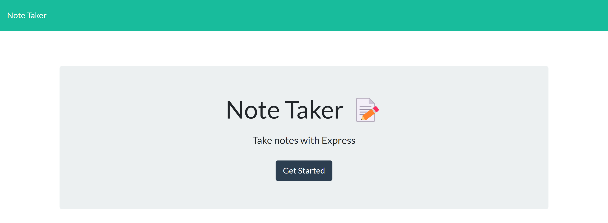

# Note Taker

## Description

This repository is where I modified starter code to create an application that can be used to write and save notes. This application uses an Express.js back end and saves and retrieves note data from a JSON file.

## Installation

N/A

## Usage

[Deployed website](https://desolate-caverns-14638.herokuapp.com/)

Click the "Get Started" button when on the home page to be taken to a page where any existing notes will be listed in the left-hand column and empty fields to enter a new note's title and text will be in the right-hand column.

A save icon will appear when you enter a new note's title and text. When you click the save icon, the new note will appear in the list of existing notes in the left-hand column. When you click on an existing note in the left-hand column, then the selected note's title and text will appear in the right-hand column. 

When you click on the plus ("+") icon in the navigation at the top of the page, then you'll be presented with empty fields to enter a new note's title and text in the right-hand column.

## Credits

N/A

## License

See repository for license information.